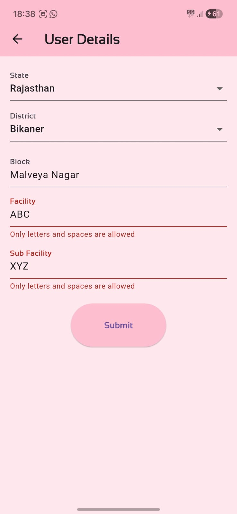
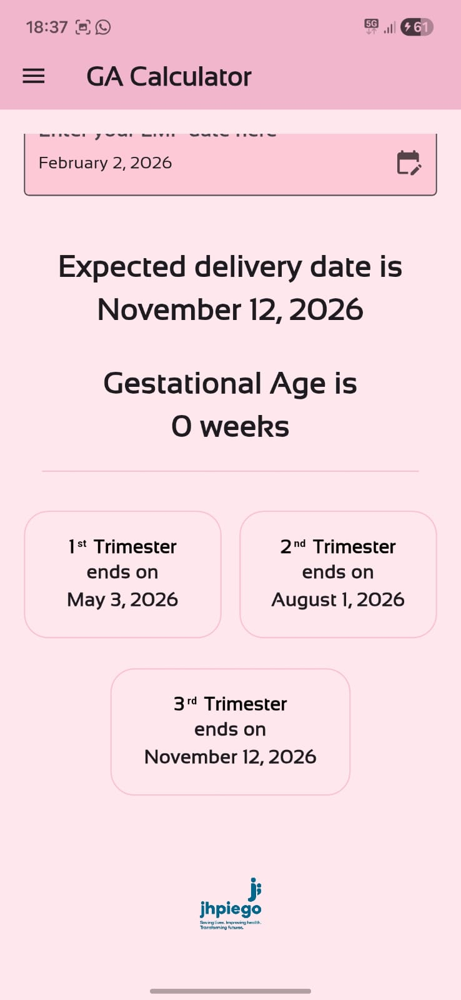

# EDD Calculator App (Prototype)

This repository contains the **first prototype** of an **EDD (Expected Delivery Date) Calculator** mobile application built using **Flutter**.

This prototype was developed during my **internship phase** as part of a **health program initiative**, where the goal was to digitize and streamline pregnancy-related data collection and calculations.

The **production-ready version** of this application has since evolved further and is currently live on the **Google Play Store** under the organization’s ecosystem.  
This repository represents the **initial technical and functional foundation** of that system.

---

## Key Features

- Expected Delivery Date (EDD) calculation
- User input handling with validation
- Capture of demographic and health-related data
- Structured data flow designed for backend integration
- Clean and simple Flutter-based UI

> Note: This repository contains only the **prototype implementation**.  
> Backend endpoints, production configurations, and sensitive logic are intentionally excluded.

---

## Tech Stack

- **Flutter**
- **Dart**
- **SQLite**

---

## Screenshots

| Intro | User Input | Home |
|------------|-----------|--------|
|  |  |  |

---

## Project Structure

edd_calc/
├── lib/
│ ├── main.dart
│ └── screens/
├── android/
├── ios/
├── pubspec.yaml
└── README.md


---

## 🚀 Getting Started

### Prerequisites
- Flutter SDK
- Android Studio or VS Code
- Android emulator or physical device

### Run Locally
```bash
git clone https://github.com/neerajkhattar02/edd_calc.git
cd edd_calc
flutter pub get
flutter run


